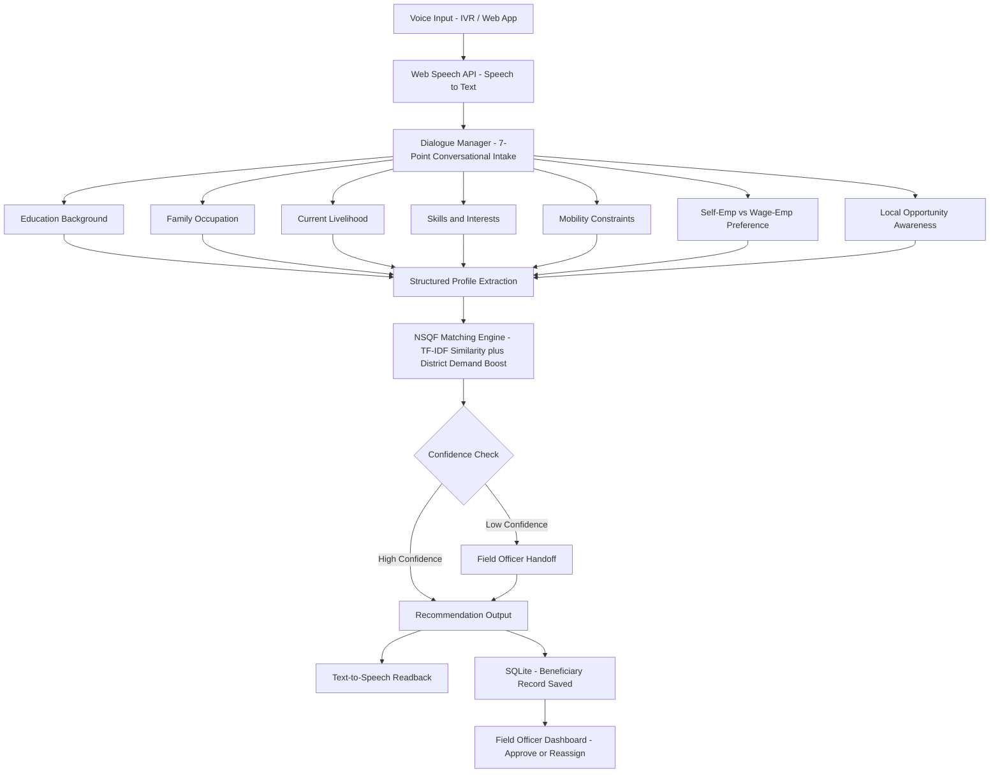

# SAARTHI

**Aapki awaaz, aapka rasta** — AI-powered multilingual voice assistant for livelihood mapping and NSQF-aligned skilling recommendations, built for Smart India Hackathon 2026 (SIH26097 — Ministry of Social Justice and Empowerment, PM-AJAY GIA component).

## Problem

PM-AJAY GIA aims to help Scheduled Caste beneficiaries through skilling and livelihood support, but implementation suffers from low digital literacy, language barriers, and mismatched training-to-opportunity recommendations — leading to high dropout and poor placement outcomes.

## Solution

SAARTHI replaces text-heavy enrollment forms with a natural voice conversation. It asks 7 simple questions (in Hindi or English), matches the beneficiary's answers against a 25+ trade NSQF catalogue using TF-IDF similarity, boosts recommendations based on real district-level demand data, and flags low-confidence matches for human review rather than risking a poor automated recommendation.

## Key Features

- Voice-only conversational intake — no typing required, accessible to low-literacy users
- Bilingual UI (Hindi / English) with live language switching
- TF-IDF-based semantic matching across 25+ NSQF-aligned trades
- District-aware recommendation boosting (local job-market demand)
- Confidence-gated human-in-the-loop safety — low-confidence matches routed to field officer review
- Field Officer Dashboard — expandable beneficiary profiles, approve/reassign actions
- IVR phone-call demo view — shows how the same system serves feature-phone users
- Text-to-speech readback of the final recommendation
- SQLite persistence for all beneficiary records

## Architecture



## Tech Stack

- **Backend:** FastAPI, scikit-learn (TF-IDF + cosine similarity), SQLite
- **Frontend:** React + Vite, Web Speech API (browser-native ASR + TTS)
- **Languages supported:** Hindi, English (full UI translation, not transliteration)

## Setup

### Backend

```powershell
cd backend
python -m venv venv
.\venv\Scripts\Activate.ps1
pip install -r requirements.txt
python seed_data.py    # optional: loads 6 sample beneficiaries for demo
uvicorn main:app --reload --port 8000
```

### Frontend

```powershell
cd frontend
npm install
npm run dev
```

Open `http://localhost:5173` in **Chrome** (Web Speech API requires Chrome/Edge — not supported in Firefox).

## Roadmap

- Integrate Bhashini (National Language Translation Mission) for production-grade multilingual ASR/TTS, replacing the browser-based Web Speech API prototype
- WhatsApp Business API voice-note channel
- Real telephony-based IVR integration (current IVR view is a UI demo of the concept)
- Post-placement feedback loop to improve recommendation accuracy over time
- Expand regional language coverage beyond Hindi/English

## Team

Built by Team [Your Team Name] for Smart India Hackathon 2026, Problem Statement SIH26097.
